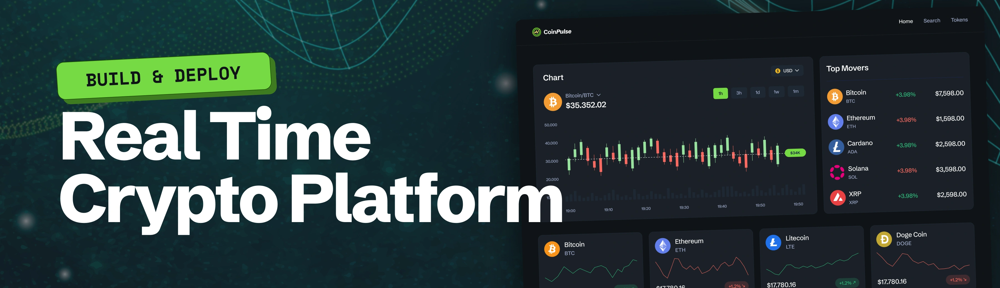

# CoinStream

**CoinStream** is a high-performance, real-time cryptocurrency analytics dashboard built with Next.js 16. It delivers up-to-the-second market intelligence, high-frequency price tracking, and live orderbook streams using the CoinGecko API and WebSockets, paired with interactive TradingView candlestick charts for surgical precision.



## 🔋 Key Features

- **Live Market Dashboard**: Instant overview of global market health, including Total Market Cap, BTC & ETH dominance, and trending assets.
- **Real-Time Data Streams**: Continuous, low-latency live price monitoring and orderbook streams powered by WebSockets.
- **Interactive Candlestick Charts**: Professional-grade multi-timeframe OHLCV visualizations using TradingView Lightweight Charts.
- **Advanced Token Discovery**: Comprehensive, paginated tables for market analysis with key metrics such as Price, 24h Change, and Market Cap.
- **Smart Currency Converter**: Instantly convert coin amounts across dozens of supported fiat and cryptocurrencies.
- **Global Search**: Unified, fast search functionality to quickly discover and navigate to any crypto asset.

## ⚙️ Tech Stack & Architecture

CoinStream is engineered for speed, modularity, and a premium developer experience.

- **Framework**: [Next.js 16](https://nextjs.org/) (App Router)
- **Language**: [TypeScript](https://www.typescriptlang.org/)
- **Styling**: [Tailwind CSS v4](https://tailwindcss.com/) & [shadcn/ui](https://ui.shadcn.com/)
- **Market Data**: [CoinGecko REST API & WebSockets](https://www.coingecko.com/)
- **Charting**: [TradingView Lightweight Charts](https://www.tradingview.com/lightweight-charts/)
- **Icons**: Lucide React

### System Architecture Highlights
- **Server-Side Data Fetching**: Centralized REST API calls using custom fetch wrappers and efficient query string handling.
- **WebSocket Orchestration**: Custom React hooks manage WebSocket lifecycle, channel subscriptions (prices, trades, OHLCV), and real-time state updates.
- **Data Merging**: Seamless integration of historical OHLC data with live WebSocket candle updates for smooth chart rendering.

## 🤸 Getting Started

Follow these instructions to set up and run the project locally.

### Prerequisites

Ensure you have the following installed on your local machine:
- [Node.js](https://nodejs.org/) (v18 or higher recommended)
- npm or yarn
- Git

### Installation

1. **Clone the repository:**
   ```bash
   git clone https://github.com/your-username/coinstream.git
   cd coinstream
   ```

2. **Install dependencies:**
   ```bash
   npm install
   ```

3. **Configure Environment Variables:**
   Create a `.env` file in the root directory and add your API credentials:
   ```env
   COINGECKO_BASE_URL=https://pro-api.coingecko.com/api/v3
   COINGECKO_API_KEY=your_rest_api_key_here

   NEXT_PUBLIC_COINGECKO_WEBSOCKET_URL=wss://ws.coingecko.com/cable
   NEXT_PUBLIC_COINGECKO_API_KEY=your_websocket_api_key_here
   ```
   *(Note: You can obtain API keys from the [CoinGecko API Dashboard](https://www.coingecko.com/en/api).)*

4. **Run the development server:**
   ```bash
   npm run dev
   ```

5. **Open the app:**
   Navigate to [http://localhost:3000](http://localhost:3000) in your browser.

## 🤝 Contributing

Contributions, issues, and feature requests are welcome! Feel free to check the [issues page](https://github.com/your-username/coinstream/issues) if you want to contribute.

## 📝 License

This project is open-source and available under the [MIT License](LICENSE).
